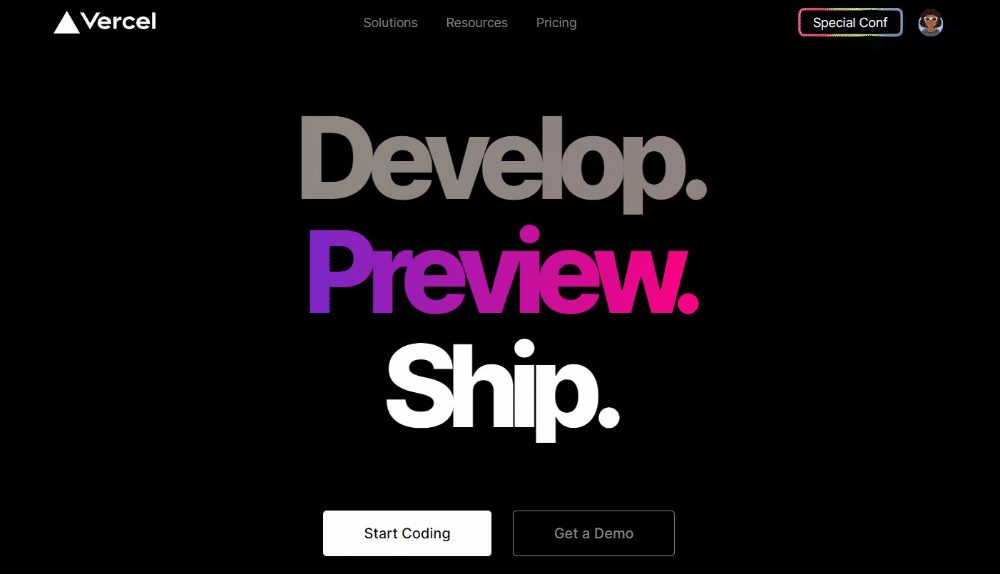

<h1 align="center">
UI Clone - Vercel (Homepage)
</h1>

## Sobre
Projeto criado a partir do video UI Clone da RocketSeat para solidificar o conhecimento de frontend, principalmente de SASS.
## Imagem do UI

## Tecnologias

- [x] HTML, SCSS, JS
- [x] SVG Images

## Requisitos para o projeto
1 Fazer o git clone https://github.com/Caioesqueletron/UI-Clone-Vercel.git
2. Abrir a pasta do projeto no `VSCode`
3. Instalar as extensões `Live Server` e `Live Sass Compiler` 
4. Clicar botão direito `index.html` > `Open with Live Server`
